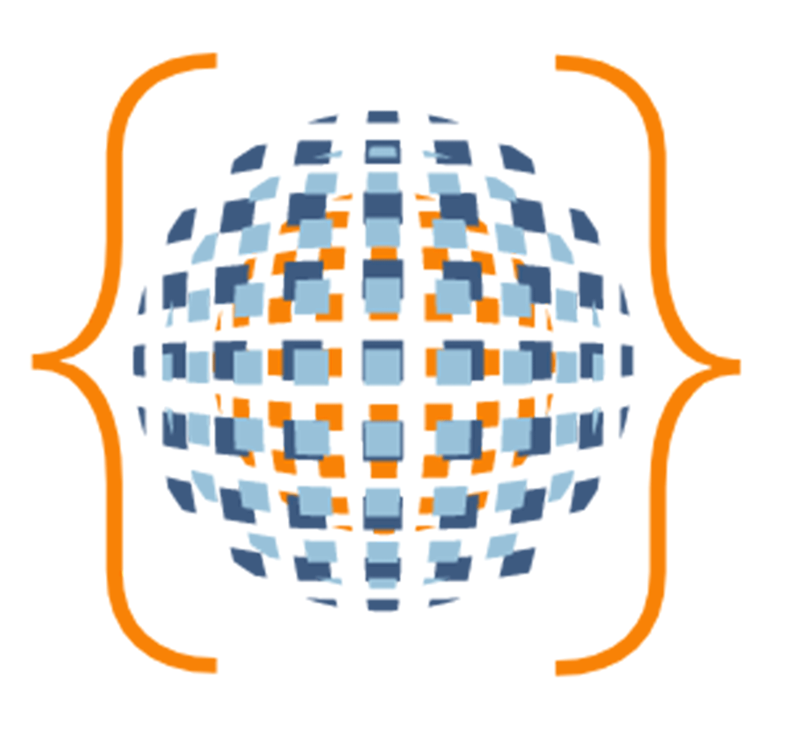

<p align="center" >

</p>
 
<h1 align="center">DeSolver</h1>
&nbsp;
 
## Table of Contents
 
- [About](https://github.com/oslabs-beta/DeSolver/#about)
- [Getting Started](https://github.com/oslabs-beta/DeSolver/#gettingstarted)
- [How to Use](https://github.com/oslabs-beta/DeSolver/#howtouse)
   - [DeSolver Instance](https://github.com/oslabs-beta/DeSolver/#desolverinstance)
   - [Cache](https://github.com/oslabs-beta/DeSolver/#cache)
   - [Desolver Fragments](https://github.com/oslabs-beta/DeSolver/#desolverfragments)
   - [Creating Middleware Pipeline](https://github.com/oslabs-beta/DeSolver/#pipeline)
   - [Targeting a specific resolver type](https://github.com/oslabs-beta/DeSolver/#targetatype)
   - [Define resolvers as multiple fragments](https://github.com/oslabs-beta/DeSolver/#multiplefragments)
- [Contributors](https://github.com/oslabs-beta/DeSolver/#team)
- [License](https://github.com/oslabs-beta/DeSolver/#license)
 
<p><br>
<h2 href="#about"></h2>
 
# About
 
DeSolver for [GraphQL](https://graphql.org/): a lightweight, minimalist, unopinionated Node.js GraphQL framework providing a powerful yet approachable API for composing modular and reusable resolver business logic.DeSolver utilizes the middleware pattern as seen in other popular frameworks as a way to create "routing" for your resolvers.
 
The DeSolver instance methods allow a pipeline to be loaded with mini-resolver functions, and a wrapper forms around the resolver map object, permitting a series of functions in a chain or "pre-hook" functions to execute prior to a query or mutation.  This minimizes the need to wrap individual resolver functions manually, thereby reducing templating and additional boilerplate. Composing resolvers in this way can help keep resolver code more maintainable, scalable and testable. It follows the "write once, run everywhere" mantra.
 
<p><br>
 
<h2 href="#gettingstarted"> </h2>
 
# Getting Started
 
1. Installing Desolver
- Note: DeSolver is currently in beta, and an npm package is not yet available. This README will be updated when a package is available. Read on for more information on the intended functionality of the framework.
 
- Start by running the npm command:
 
```javascript
npm install desolver
```
- The DeSolver framework works best when combined with [GraphQL tools](https://www.graphql-tools.com/docs/generate-schema) Executable Schema package. It is recommended to download that package and use that to generate your type definitions, resolver map and schema.
 
- The DeSolver framework also works with the popular Apollo Server API.  DeSolver can be utilized when combined with the resolver map object in Apollo Server.
 
- Redis is used for caching resolvers. Check out [Redis](https://redis.io) and [node-redis](https://github.com/redis/node-redis) for installation details. If it is not desired to use Redis, instead using custom caching logic, DeSolver provides a configuration option to disable this default behavior.
 
<p><br>
 
<h2 href="#howtouse"></h2>
 
# How to use
 
<h3 href="#desolverinstance"></h3>
 
### **Desolver Instance and Configuration**
 
In your GraphQL server or resolvers file create a new instance of DeSolver:
 
```javascript
const desolver = new Desolver(desolverConfig)
```
 
The following optional configuration object can be declared as the argument of the DeSolver constructor:
 
```javascript
const desolverConfig = {
 cacheDesolver?: boolean, // set to true to enable Redis caching
 applyResolverType?: string // resolver type to target for running prehooks
}
```
 
- `cacheDesolver`: Set to true to enable Redis caching, by default if nothing is passed, the default redis instance will be started. Set to false to disable this behavior.
 
- `applyResolverType`: Takes a string value that represents either a root query ( `Query`, `Mutation` ) or some other custom type as defined in your schema.  Specify `Root` to chain both `Query` and `Mutation`. Set to `All` to wrap every resolver. By default, if none is specified, all resolvers will be chained to the middleware pipeline.
 
The desolverConfig object can also be defined with configuration options from Redis. See [node-redis](https://github.com/redis/node-redis) for a list of additional custom configuration options that can be defined from Redis.
<br><br>
 
<h3 href="#cache"></h3>
 
### **Cache**
 
DeSolver utilizes Redis caching for greater query optimization. If `cacheDesolver` option is set to `true`, this will enable automated caching of resolver queries. DeSolver will automatically generate a unique key for the Redis cache based on path property from within the info argument. Set the `cacheDesolver` property to `false` if you would like to disable this default behavior and provide your own caching logic.
<br><br>
 
<h3 href="#desolverfragments"></h3>
 
### **Desolver Fragments**
 
DeSolver Fragments are used as versions of middleware functions. Each resolver can be decomposed into a series of "fragment" functions. To maintain full functionality of a normal resolver, it provides the current field resolvers first four arguments (root/parent, arguments, context, and info), as well as three additional custom parameters (next, escape, and ds).
 
```javascript
const desolverFragment = (parent, args, context, info, next, escape, ds) => {
 // write your resolver business logic here
 // parent, args, context and info are available for use here
 // ds context object is also provided by this framework
 
 // @return
   // next() - calls the next function in the middleware chain
   // escapeHatch(input) - pass a value to input to resolve immediately
}
```
 
The DeSolver Parameters are as follows:
 
The first four parameters are the normal parameters for any resolver:
- `parent`: Sometimes referred to as the root object. The same parent/root object which is the result of the previous parent/type.
- `arguments`: Arguments provided to the root or field resolver.
- `context`: a mutable object that is provided to all resolvers.
- `info`: field specific information relevant to the query.
 
The final three parameters are additional parameters provided by the DeSolver framework:
- `next`: Calls the next DeSolver Fragment in the middleware chain.
- `escapeHatch`: Immediately resolves the current root or field resolver.
- `ds`: A context object that can be passed from one DeSolver Fragment to the next. Similar in functionality to res.locals in the Express framework.
<br><br>
<h3 href="#pipeline"></h3>
 
### **Creating the middleware pipeline**
 
Utilize the `desolver.use()` method on the desolver instance to generate your pipeline of prehook functions. Any number of function arguments passed to `desolver.use()` will be pushed to the function pipeline. Multiple successive invocations of `desolver.use()` will also add additional functions to the pipeline.
 
The following is an example use case for the desolver middleware pipeline involving guarding root queries with authentication logic:
 
```javascript
const desolver = new Desolver()
 
// Declare authentication Desolver Fragment Function
const authentication = (parent, args, context, info, next, escape, ds) => {
 // Define some authentication logic here using args or context
 // throw error if not authenticated
}
 
// Add to the authentication function to pipeline with desolver.use()
// This function will execute prior to all resolvers
desolver.use(authentication)
 
// Invoke desolver.apply() method with the resolver map object passed
const resolvers = desolver.apply({
 Query: {
   getUserById: (parent, args, context, info) => {
     // this root query is now guarded by the authentication function
   },
 
   getPostsById: (parent, args, context, info) => {
     // this root query is now guarded by the authentication function
   },
 }
 
 // Additional resolvers here
})
```
<br><br>
<h3 href="#multiplefragments"></h3>
 
### **Define resolvers as multiple DeSolver fragments**
 
Defining root or field level resolvers as a chain of DeSolver fragments is a resolver function declared utilizing `desolver.useRoute()`.  The `useRoute` method takes any number of Desolver Fragment middleware functions and forms a "route" for the root or field resolver.
 
All methods `desolver.use()`, `desolver.apply()`, and `desolver.useRoute()` can be utilized together to form a more modular and scalable way to compose resolvers.
 
See the example below:
 
```javascript
// desolver.use(), desolver.apply() and desolver.useRoute() can
// be used together to create longer chains
 
desolver.use(authentication)
 
const resolvers = desolver.apply({
 Query: {
   // Define your resolver using desolver.useRoute() and add
   // any number of desolver fragments to modularize resolver logic
   // The authentication function will execute followed by desolverFragment1
   // and desolverFragment2
   getUserById: desolver.useRoute(desolverFragment1, desolverFragment2),
 
   // desolver.use(), desolver.apply(), desolver.useRoute() and
   // normal resolver functions used together seamlessly throughout the
   // resolver map
   getPostsById: (parent, { id }, context, info) => {
     return ctx.db.findPosts(id)
   },
 }
})
```
<br><br>
 
<h3 href="#targetatype"></h3>
 
### **Targeting a specific resolver or type**
 
To chain resolvers to a specific root type or field resolvers, specify the root query or field to chain the middleware pipeline into the configuration object passed to the DeSolver constructor.
 
See the example below:
 
```javascript
// Specify when instantiating Desolver which resolvers to chain to in the
// configuration object
const desolver = new Desolver({
 applyResolverType: 'Query'
})
 
desolver.use(authentication)
 
const resolvers = desolver.apply({
 Query: {
   // Only these root query resolvers will be guarded by the authentication
   // function
   getUserById: desolver.useRoute(desolverFragment1, desolverFragment2),
 
   getPostsById: (parent, { id }, context, info) => {
     return ctx.db.findPosts(id)
   },
 }
 
 Mutation: {
   createUser: (parent, root, args, context, info) => {
     // This mutation is not guarded by the authentication logic
     // set applyResolverType to 'Root' to wrap chain to both
     // 'Query' and 'Mutation'
   }
 }
})
```
<p><br>
<h3 href="#team"></h3>
 
# **Contributors**
 
DeSolver is an open-source community project on Github and accelerated by [OS Labs](https://opensourcelabs.io/). We are maintained by a small group of dedicated software engineers. We appreciate your participation, feedback, bug fixes and feature developments.
 
<p><br>
 
|                     | GitHub                           | LinkedIn                                        |
| ------------------- | -------------------------------- | ----------------------------------------------- |
| Michael Chan        | https://github.com/mckchan13     | https://www.linkedin.com/in/michael-ck-chan/    |
| Mia Kang            | https://github.com/jcmiakang     | https://www.linkedin.com/in/mia-kang/           |
| Alexander Gurfinkel | https://github.com/AlexGurfinkel | https://www.linkedin.com/in/alexandergurfinkel/ |
| Julia Hickey        | https://github.com/hijulia1136   | https://www.linkedin.com/in/juliahickey/        |
 
<p><br>
If you are interested in creating an open-source project that builds on top of DeSolver, please don't hesitate to reach out, and we'd be happy to provide feedback and support.
 
<p><br>
<h3 href="#license"></h3>
 
# License
 
This product is licensed under the MIT License - see the LICENSE.md file for details.
 
This is an open source product.
 
This product is accelerated by [OS Labs](https://github.com/oslabs-beta).
